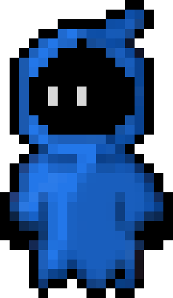
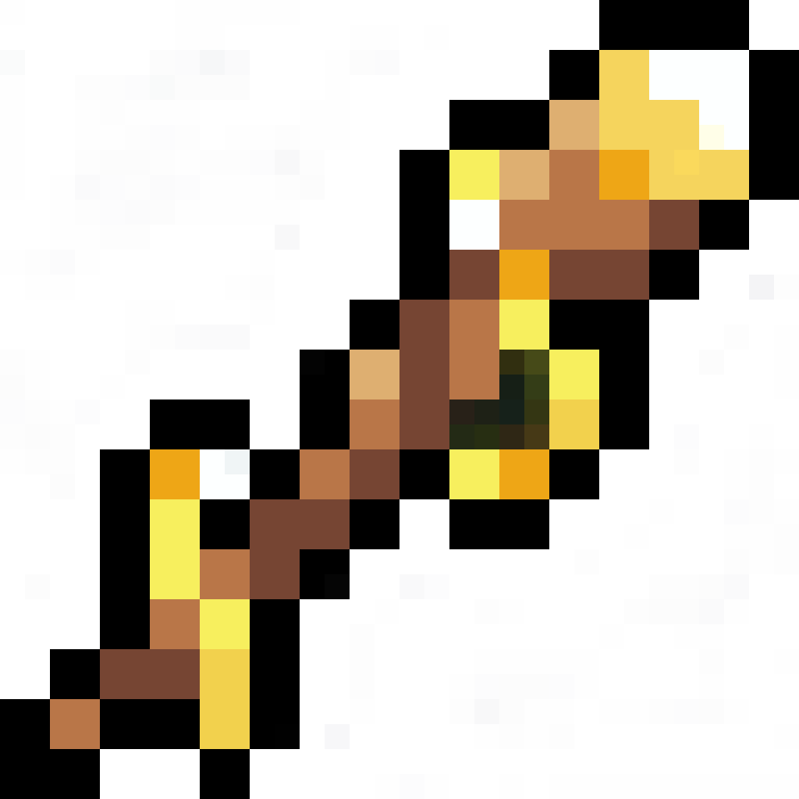
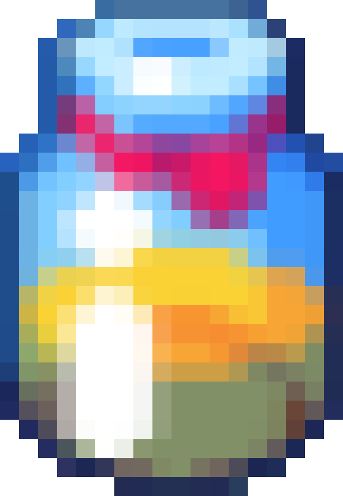

# Bluegun

## Introduction
This is our portfolio project to end our foundations year at [Holberton School](https://www.holbertonschool.com). We chose to develop a 2D top-down Rogue-like game on the [Unity](https://unity.com) engine.

### What's a Rogue-like game?
Rogue-like games are a subgenre of video game characterized by dungeon crawling through procedurally generated levels with permanent death of the player. *Rogue* (1980), is the forerunner of the subgenre and gave it its name.

More recent popular Rogue-like games are: *The Binding of Isaac* (2011), *Spelunky* (2008), *Hades* (2020) or the *Pokémon Mystery Dungeon* (2005) series inspired by the Japanese game series *Mystery Dungeon* (1993).

### What is Bluegun like?
In *Bluegun*, you play as a mage. This mage goes through a number of procedurally generated rooms to obtain different weapons, armors or artifacts to make yourself more powerful and resistant to the hordes of enemies trying to stop you from going further.

|  |  |  | 
|:--:|:--:|:--:|:--:|
| *Player* | *Weapon* | *Armor* | *Artifact* |

You can read more informations about the game by taking a look at the [landing page](adut24.github.io).

## Download
Here are the links to download the game depending on the operating system you are using:
- [Windows]()
- [Linux]()
- [MacOS]()

## Usage
To launch the game, go inside the folder downloaded in the previous step and double click on the executable file named after the game.

## Contributing
- **Nicolas Bouté**: [Github](https://github.com/nboute) - [LinkedIn](https://www.linkedin.com/in/nicolas-boute/)
- **Pierre Dureau**: [Github](https://github.com/Pierre-Dureau) - [LinkedIn](https://www.linkedin.com/in/pierre-dureau)
- **Alexandre Dutertre**: [Github](https://github.com/adut24) - [LinkedIn](https://www.linkedin.com/in/alexandredut)

## Related projects
TBA

## Special Thanks
A huge thanks to the people on sites like [OpenGameArt](https://opengameart.org/) and [itch.io](https://itch.io/), which provide usage-free sprites with animations or assets.

## Licensing
TBA
