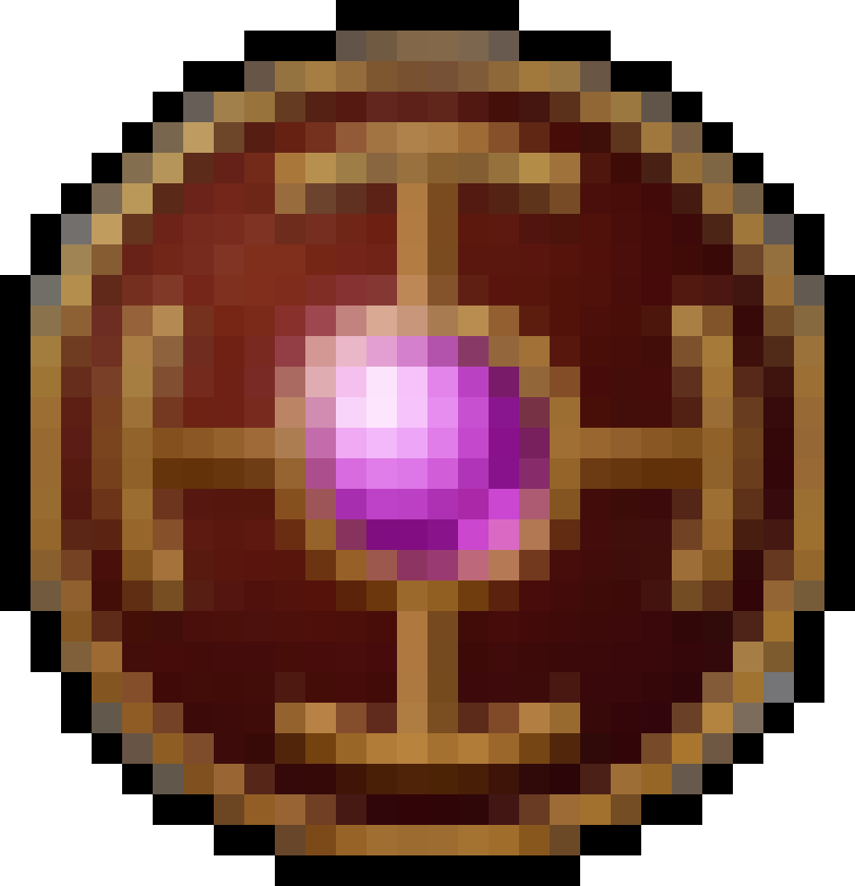

# Bluegun

## Introduction
This is our portfolio project to end our foundations year at [Holberton School](https://www.holbertonschool.com). We chose to develop a 2D top-down pixel art Rogue-like game on the [Unity](https://unity.com) engine.

### What's a Rogue-like game?
Rogue-like games are a subgenre of video game characterized by **dungeon crawling** through **procedurally generated** levels with **permanent death** of the player. *Rogue* (1980), is the forerunner of the subgenre and gave it its name.

More recent popular Rogue-like games are: *[The Binding of Isaac](https://en.wikipedia.org/wiki/The_Binding_of_Isaac_(video_game))* (2011), *[Spelunky](https://en.wikipedia.org/wiki/Spelunky)* (2008), *[Hades](https://en.wikipedia.org/wiki/Hades_(video_game))* (2020) or the *[Pokémon Mystery Dungeon](https://en.wikipedia.org/wiki/Pokémon_Mystery_Dungeon)* (2005) series inspired by the Japanese game series *[Mystery Dungeon](https://en.wikipedia.org/wiki/Mystery_Dungeon)* (1993).

### What is Bluegun like?
In *Bluegun*, you play as a mage. This mage goes through a number of procedurally generated rooms to obtain different weapons, armors or artifacts to make yourself more powerful and resistant to the hordes of enemies trying to stop you from going further.

You go through each room, one at a time inspired by *Hades* on that aspect, with the enemies becoming stronger and stronger as you advance.

|  |  |  | 
|:--:|:--:|:--:|:--:|
| *Player* | *Weapon* | *Armor* | *Artifact* |

You can read more informations about the game by taking a look at the [landing page](adut24.github.io).

## Download
Here are the links to download the game depending on the operating system you are using:
- [Windows]()
- [Linux]()
- [MacOS]()

**Currently none of the links work as we didn't release any builds yet**.

## Usage
To launch the game, go inside the folder downloaded in the previous step and double click on the executable file named after the game.

## Contributing
- **Nicolas Bouté**: [Github](https://github.com/nboute) - [LinkedIn](https://www.linkedin.com/in/nicolas-boute/)
- **Pierre Dureau**: [Github](https://github.com/Pierre-Dureau) - [LinkedIn](https://www.linkedin.com/in/pierre-dureau)
- **Alexandre Dutertre**: [Github](https://github.com/adut24) - [LinkedIn](https://www.linkedin.com/in/alexandredut)

## Related projects
During our foundations year, we didn't work on projects remotely close to this one, as it's the first time we worked on a game and Unity with C#.

As for how we organized ourselves, the only project we did the three of us together was the [Sorting Algorithms](https://github.com/Pierre-Dureau/sorting_algorithms) project in C.

## Special Thanks
A huge thanks to the people on sites like [OpenGameArt](https://opengameart.org/) and [itch.io](https://itch.io/), which provide usage-free sprites with animations or assets.

## Licensing

**MIT License**

Copyright © 2022 Alexandre Dutertre, Nicolas Bouté, Pierre Dureau

Permission is hereby granted, free of charge, to any person obtaining a copy
of this software and associated documentation files (the "Software"), to deal
in the Software without restriction, including without limitation the rights
to use, copy, modify, merge, publish, distribute, sublicense, and/or sell
copies of the Software, and to permit persons to whom the Software is
furnished to do so, subject to the following conditions:

The above copyright notice and this permission notice shall be included in all
copies or substantial portions of the Software.

THE SOFTWARE IS PROVIDED "AS IS", WITHOUT WARRANTY OF ANY KIND, EXPRESS OR
IMPLIED, INCLUDING BUT NOT LIMITED TO THE WARRANTIES OF MERCHANTABILITY,
FITNESS FOR A PARTICULAR PURPOSE AND NONINFRINGEMENT. IN NO EVENT SHALL THE
AUTHORS OR COPYRIGHT HOLDERS BE LIABLE FOR ANY CLAIM, DAMAGES OR OTHER
LIABILITY, WHETHER IN AN ACTION OF CONTRACT, TORT OR OTHERWISE, ARISING FROM,
OUT OF OR IN CONNECTION WITH THE SOFTWARE OR THE USE OR OTHER DEALINGS IN THE
SOFTWARE.
